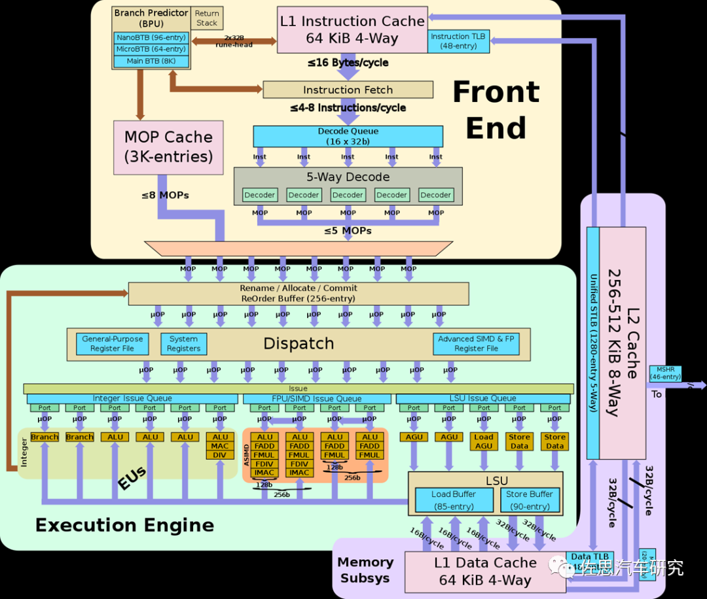

# 计算机体系结构

## ISA

## CPU

### 单周期

### 流水线

### 超标量

#### 乱序执行简介

指令在执行过程中不按照指令顺序执行，在乱序情况下，只要一条指令所需要的数据准备好了，那么就执行这条指令，而不用像顺序执行一样既要准备好数据，又要前面的指令把“路”让出来。

在五级流水线中只有一个配置，而乱序执行要求处理器实现“多配置”，实现“多配置”的流水线处理器就是多配置流水的，多配置流水的处理器可以实现乱序执行。

#### 记分牌算法

#### tomasulo算法

#### 重排序缓存

#### 阶段

##### Fetch（取指令）

这部分负责从I-Cache中取指令，I-Cache负责存储最近常用的指令；分支预测器用来决定下一条指令的PC值。

##### Decode（解码）

识别指令的类型

##### RegisterRenaming（寄存器重命名）

解决WAW和WAR这两种“伪相关性”，需要使用寄存器重命名的方法，将指令集中定义的逻辑寄存器重命名为处理器内部使用的物理寄存器。物理寄存器的个数更多于逻辑寄存器，处理器可以调度更多可以并行执行的指令。将存在RAW的寄存器进行标记，后续通过旁路网络（bypassing network）解决存在的“真相关性”。

##### Dispatch（分发）

被重命名之后的指令会按照程序中的规定顺序，写到发射队列（Issue Queue）、重排序缓存（ROB）和Store Buffer等部件中

##### Issue（发射）

经过流水线的分发（Dispatch）阶段之后，指令被写到了发射队列（Issue Queue）中，仲裁（select）电路回从这个部件中挑选出合适的指令送到FU中执行。

##### RegisterFile Read（读取寄存器）

被仲裁电路选中的指令需要从物理寄存器堆（Physical Register File，PRF）中读取操作数

##### Execute（执行）

各种FU单元执行

##### Writeback（写回）

将FU计算的结果写到物理寄存器（PRF）中，通过旁路网络将计算结果送到需要的地方。

##### Commit（提交）

这个阶段起主要作用的部件是重排序缓存（ROB），它将乱序执行的指令拉回到程序中规定的顺序。

## 存储器

## io设备

## 总线

## 软硬件协同

